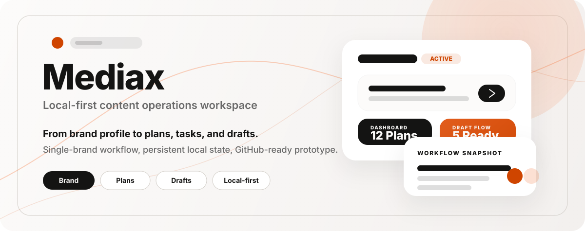

<div align="center">

</div>

# Mediax

Mediax is a Vite + React content operations workspace prototype for a single brand team.  
This version turns the original static UI into a local-first app with:

- route-based navigation
- local login guard
- persistent brand profile data
- plan -> task -> draft workflow
- draft editing and local storage persistence

## Tech Stack

- React 19
- TypeScript
- Vite
- Tailwind CSS 4
- React Router
- Vitest + Testing Library

## Local Development

**Prerequisites:** Node.js 20+ recommended

1. Install dependencies

```bash
npm install
```

2. Copy the example env file if needed

```bash
cp .env.example .env.local
```

`GEMINI_API_KEY` is currently optional and reserved for future AI-related features.

3. Start the dev server

```bash
npm run dev
```

4. Open the app

```text
http://localhost:3000
```

## Demo Login

Use the built-in local admin account:

```text
Email: admin@mediax.local
Password: mediax2026
```

## Available Scripts

```bash
npm run dev
npm test
npm run lint
npm run build
```

## Project Notes

- Data is stored locally in the browser via `localStorage`.
- This repository currently targets a single-brand, single-admin workflow.
- `Library` remains a prototype view; real uploads are intentionally not implemented yet.
- External publishing integrations and AI features are not part of the current release.

## Origin

This project started from an AI Studio-exported front-end prototype and was then adapted into a more usable local-first workflow app.
